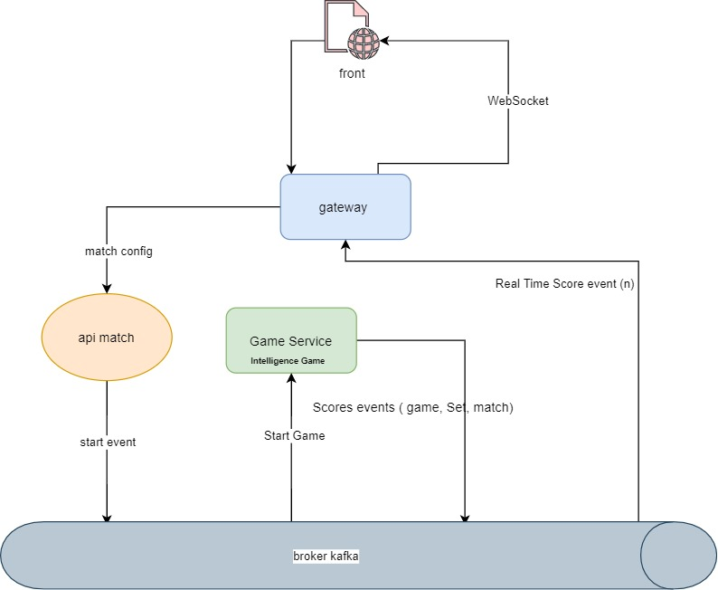

# tennis-kata

### How to use

### for Tennis match service 

> you have to run docker-compose for Kafka and kafdrop if you want to monitor topics
> specify different ports for you apps in VM options ( -Dserver.port=8082 ) for example
> use environment variables as KAFKA_HOST=localhost;KAFKA_TOPIC=GAME_TOPIC;KAFKA_GROUP=TENNIS
> you have a Dockerfile if you use docker
